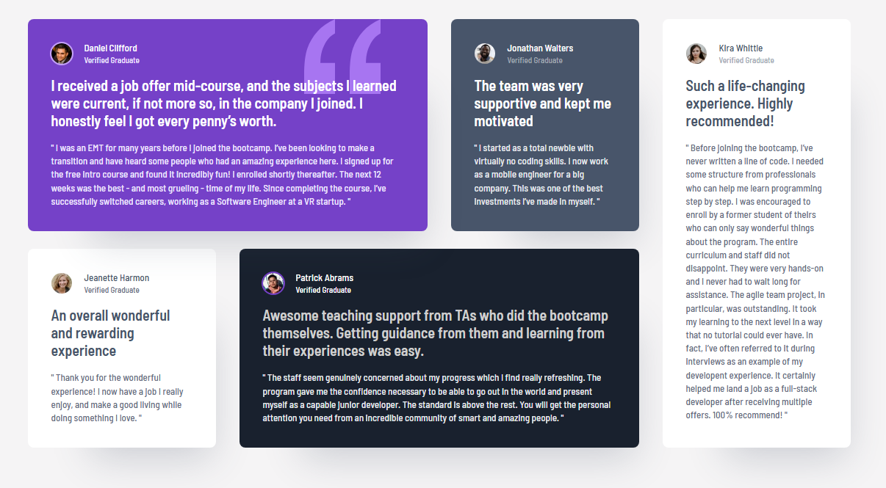

# Frontend Mentor - Testimonials grid section solution

This is a solution to the [Testimonials grid section challenge on Frontend Mentor](https://www.frontendmentor.io/challenges/testimonials-grid-section-Nnw6J7Un7). Frontend Mentor challenges help you improve your coding skills by building realistic projects.

## Table of contents

- [Overview](#overview)
  - [The challenge](#the-challenge)
  - [Screenshot](#screenshot)
  - [Links](#links)
- [My process](#my-process)
  - [Built with](#built-with)
  - [What I learned](#what-i-learned)
  - [Continued development](#continued-development)
  - [Useful resources](#useful-resources)
  - [AI Collaboration](#ai-collaboration)
- [Author](#author)
- [Acknowledgments](#acknowledgments)

## Overview

### The challenge

Users should be able to:

- View the optimal layout for the site depending on their device's screen size

The five cards stack in a single column on mobile. From `768px` they move onto a two-column grid: Daniel and Patrick span the full width, Jonathan and Jeanette sit side by side, and Kira stays on the last row. From `1024px` the layout becomes the familiar desktop mosaic — four columns and two rows — with Daniel spanning two columns, Patrick spanning two on the row below, and Kira stretching the full height of the last column.

### Screenshot



### Links

- [Live Site URL](https://diogoluxa.github.io/frontend-mentor-testimonials-grid/)
- [Solution URL](https://github.com/DiogoLuxa/frontend-mentor-testimonials-grid)

## My process

### Built with

- Semantic HTML5 (`main`, `article`, `header`, `blockquote`)
- CSS custom properties for colors, type, spacing, and radius tokens
- Flexbox for card internals (avatar row, stacked copy)
- CSS Grid for the five-card layout at each breakpoint
- Mobile-first workflow, with layout changes at `768px` and `1024px`
- BEM-style class names (`card`, `card__quote`, `card--daniel`)
- [Barlow Semi Condensed](https://fonts.google.com/specimen/Barlow+Semi+Condensed) from Google Fonts

### What I learned

The interesting part of this challenge is not styling five similar cards — it is **placing the same component on different grid lines** as the screen grows.

**One card, five modifiers.** Every testimonial shares the same structure: avatar, name, highlight, quote. Background and text color are the only visual differences, so a base `.card` plus modifiers (`card--daniel`, `card--kira`, …) kept the CSS from repeating five almost-identical blocks.

```html
<article class="card card--daniel">
  <header class="card__header">
    
    <div class="card__author">
      <h2 class="card__name">Daniel Clifford</h2>
      <p class="card__status">Verified Graduate</p>
    </div>
  </header>
  <p class="card__highlight">I received a job offer mid-course…</p>
  <blockquote class="card__quote">
    <p class="card__quote-text">" I was an EMT for many years… "</p>
  </blockquote>
</article>
```

Avatars sit next to a heading that already names the person, so `alt=""` tells screen readers to skip a redundant photo. The longer quote lives in `<blockquote>` because it is a citation, not just another paragraph.

**Grid line placement, not five different layouts.** On desktop the grid is four columns and two rows. `grid-area` maps each card onto those lines: Daniel covers columns 1–2 on row 1, Patrick covers columns 2–3 on row 2, and Kira spans both rows in column 4.

```css
@media (min-width: 1024px) {
  .cards {
    grid-template: repeat(2, auto) / repeat(4, 1fr);
  }

  .card--daniel {
    grid-area: 1 / 1 / 2 / 3;
  }

  .card--kira {
    grid-area: 1 / 4 / -1 / -1;
  }
}
```

Tablet needed a different map: two columns and four rows, with Daniel, Patrick, and Kira stretching across the full width. That is why the placement rules are rewritten at `768px` instead of trying to force one grid to work everywhere.

**Decorative quotation marks without extra HTML.** Daniel’s card uses a `::before` pseudo-element and the SVG as a background image. `isolation: isolate` creates a stacking context on the card, so `z-index: -1` on the quote graphic stays **above the purple background** and **behind the text**.

```css
.card--daniel {
  position: relative;
  isolation: isolate;
}

.card--daniel::before {
  content: "";
  position: absolute;
  top: 0;
  right: 4rem;
  width: 104px;
  height: 102px;
  background-image: url("../images/bg-pattern-quotation.svg");
  z-index: -1;
}
```

**Design tokens in `:root`.** Pulling the style-guide colors, type scale, and spacing into custom properties meant I could tweak a value once instead of hunting through the stylesheet.

```css
:root {
  --color-primary-purple-500: hsl(263, 55%, 52%);
  --color-neutral-dark-blue: hsl(219, 29%, 14%);
  --font-primary: "Barlow Semi Condensed", sans-serif;
  --space-xl: 2rem;
}
```

### Continued development

I want to keep practicing:

- CSS Grid placement (`grid-area`, line numbers, and `grid-template-areas`) until mosaic layouts are something I can sketch before I write CSS
- Decorative images with pseudo-elements, stacking contexts, and `isolation`
- Layouts that hold up from about `320px` up, not only the 375 / 768 / 1440 design widths
- A small Git / GitHub Pages habit, so the live URL is ready before I submit on Frontend Mentor

### Useful resources

- [CSS-Tricks: A Complete Guide to CSS Grid](https://css-tricks.com/snippets/css/complete-guide-grid/) — visual reference for rows, columns, and spanning items, which is the whole desktop layout
- [MDN: `grid-area`](https://developer.mozilla.org/en-US/docs/Web/CSS/grid-area) — why `1 / 1 / 2 / 3` places a card on specific grid lines
- [MDN: `isolation`](https://developer.mozilla.org/en-US/docs/Web/CSS/isolation) — why `isolate` keeps `z-index: -1` from disappearing behind the page
- [MDN: `::before`](https://developer.mozilla.org/en-US/docs/Web/CSS/::before) — decorative quotation marks without extra markup
- [MDN: `<blockquote>`](https://developer.mozilla.org/en-US/docs/Web/HTML/Element/blockquote) — the right element for a pulled quote
- [Frontend Mentor style guide for this challenge](./style-guide.md) — colors, type, and layout widths

### AI Collaboration

I used [Cursor](https://cursor.com/) as a learning partner on this project, not as a “write the whole solution” tool.

- **What I used it for:** filling this README from the finished HTML and CSS, and talking through layout ideas while building
- **What worked well:** describing _why_ Grid line placement and a stacking context fit this design (one card component, different positions, decorative quote behind the copy) instead of pasting a finished stylesheet
- **What I still did myself:** writing `index.html` and the CSS files, matching the Figma / design files, and choosing the mobile, tablet, and desktop breakpoints

## Author

- Frontend Mentor - [@DiogoLuxa](https://www.frontendmentor.io/profile/DiogoLuxa)

## Acknowledgments

Thanks to [Frontend Mentor](https://www.frontendmentor.io) for the challenge, the style guide, and the design files.
